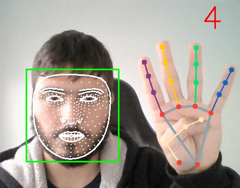

<p align="center">
  
</p>

# Detector de Face e Mão

```diff
!! PROJETO EM DESENVOLVIMENTO !!
```

Este projeto está sendo desenvolvido, então pode apresar bugs e situações estranhas. Busco sempre manter o README atualizado com tudo já implementado e com o mínimo possível para rodar o programa. Sinta-se livre para testá-lo :D.

Detecta faces (box), malha da face, mão, conta quantos dedos estão levantados e coloca malha da face em uma imagem de background.

É possível utilizar a mão para realizar algumas atividades, mais detalhes na sessão “Funcionalidades”

Quase tudo está sendo feito utilizado MediaPipe (com algumas pequenas alterações).

## Instalações e preparações

### Pré-requisitos

#### Bibliotecas:
* Python v3.9.6
* MediaPipe v0.8.7
* Numpy v1.19.5
* OpenCV v4.5.3


### Instalação

Pode ser instalado manualmente do Github ou rodando o seguinte comando:

    git clone https://github.com/MaxwellFB/Detector_Face_Mao.git

## Como rodar
Todas as funcionalidades e alterações disponíveis estão dentro do arquivo “main.py”. Podendo elas serem acessadas via comandos com a mão (descrito na sessão “Funcionalidades”).

## Funcionalidades
**Atenção:** Recomendo manter a mão reta para cima (quando a mão estiver aberta o indicador deve apontar para o teto/ceu) para um melhor funcionamento.

### Comandos
Todos os comandos são realizados ao levantar dedos específicos. Abaixo segue todos os comandos e suas funcionalidades disponíveis.

#### Menu — Indicador e mindinho
Abre uma nova janela com as opções disponíveis (listadas na sessão “Funções”). Para selecionar a opção é necessário levanta a quantidade de dedo informado.

#### Face com background - Indicador, mindinho e polegar
Coloca face dentro do background informado no início do arquivo “main.py”


#### Encerrar — Indicador, anelar e mindinho
Encerra toda aplicação

### Funções
Existem 5 filtros que serão aplicadas na imagem da webcam em tempo real, conforme a opção do menu selecionada. Para controlar a intensidade do filtro basta alternar a quantidade de dedos levantados (pode ser usado até 2 mãos — 10 dedos). Segue lista de filtros disponíveis:

* Blur
* GaussianBlur
* MedianBlur
* Erode
* Dilate

**Atenção:** Código configurado para utilizar webcam


## Autor
* **Maxwell F. Barbosa** - [MaxwellFB](https://github.com/MaxwellFB)
