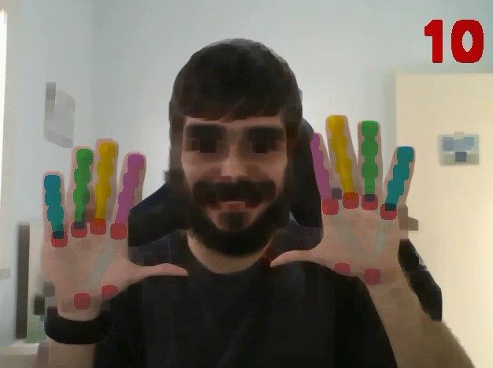

  

# Inteligência Artificial Em Tudo
Detecta faces (box), malha da face, mão, conta quantos dedos estão levantados, coloca malha da face em uma imagem de background e roda alguns jogos utilizando detecção do corpo.

É possível utilizar a mão e corpo para realizar algumas atividades, mais detalhes na sessão “Funcionalidades”

Quase tudo foi realizado utilizado MediaPipe (com algumas pequenas alterações).

**Atenção:** Código configurado para utilizar webcam

## Instalações e preparações

### Pré-requisitos

#### Python e bibliotecas:
* Python v3.9.6
* MediaPipe v0.8.7
* Numpy v1.19.5
* OpenCV v4.5.3

#### Repositórios:
* [Skyer_Game_Like_Gym](https://github.com/MaxwellFB/Skier_Game_Like_Gym) — Copiar pasta inteira para dentro de “Jogos”
* [Car_Race_Game_Like_Gym](https://github.com/MaxwellFB/Car_Race_Game_Like_Gym) — Copiar pasta inteira para dentro de “Jogos”

## Como rodar
Todas as funcionalidades e alterações disponíveis estão dentro do arquivo “main.py”. Podendo elas serem acessadas via comandos com a mão (descrito na sessão “Funcionalidades”).

## Funcionalidades
**Atenção:** Recomendo manter a mão reta para cima (quando a mão estiver aberta o indicador deve apontar para o teto/ceu) para um melhor funcionamento.

### Comandos
Todos os comandos são realizados ao levantar dedos específicos. Abaixo segue todos os comandos e suas funcionalidades disponíveis.

#### Menu — Indicador e mindinho
Abre uma nova janela com as opções disponíveis (listadas na sessão “Funções”). Para selecionar a opção é necessário levanta a quantidade de dedo informado.

#### Face com background - Indicador, mindinho e polegar
Coloca face dentro do background informado no início do arquivo “Atividades/face_mesh_background.py”

#### Encerrar — Indicador, anelar e mindinho
Encerra toda aplicação

### Funções

#### Filtros
Filtros que serão aplicadas na imagem da webcam em tempo real, conforme a opção do menu selecionada. Para controlar a intensidade do filtro basta alternar a quantidade de dedos levantados (pode ser usado até 2 mãos — 10 dedos). Segue lista de filtros disponíveis:

* Blur
* GaussianBlur
* MedianBlur
* Erode
* Dilate

 

#### Jogos
Jogos que podem ser jogados utilizando o movimento do corpo:

* Skier — Recomendado estar aparecendo no mínimo a cintura para cima. Conforme move a parte superior do corpo o personagem vai para esquerda, reto ou direta (simulando o movimento de esquiar)

* Car Race — Recomendado estar aparecendo o máximo possível do corpo. Dependendo a região que estiver na câmera o carro se move, podendo estar na esquerda, no centro ou na direita.

**Atenção:** Todos testes realizados foram em CPU, caso rode em GPU (ou dependendo a velocidade da CPU) pode ser necessário diminuir (ou aumentar) a velocidade do jogo no arquivo “Atividades/jogos.py” os parâmetros “low_speed” e “max_speed”.

## Autor
* **Maxwell F. Barbosa** - [MaxwellFB](https://github.com/MaxwellFB)
